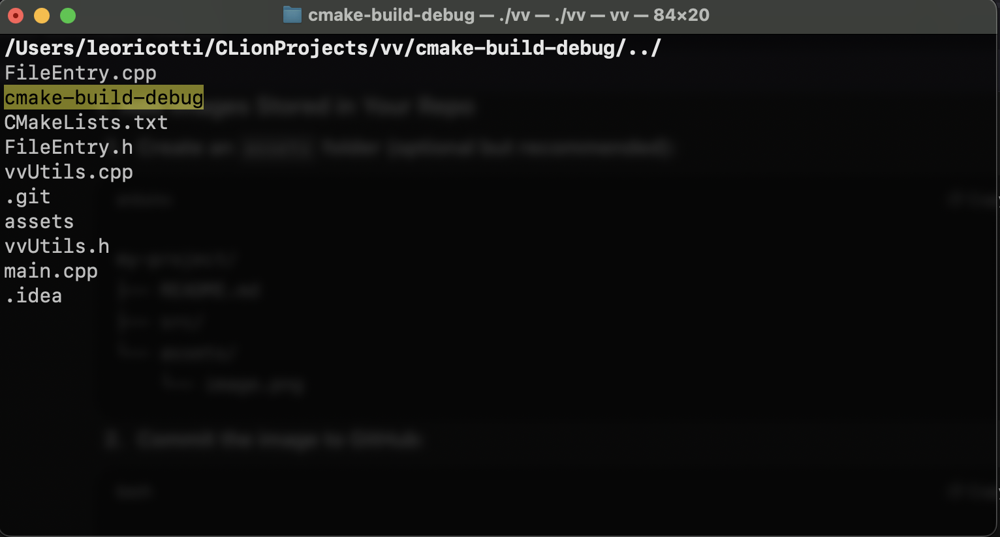

# VV - Visual, Terminal Based File Explorer

VV is a terminal-based, interactive file explorer written in C++. It allows users to navigate directories, view files, and explore folder structures directly from the terminal. VV highlights the selected file or directory and supports keyboard navigation using arrow keys and the Enter key.

## Features
- Navigate directories interactively in the terminal.
- Highlight the currently selected file or folder.
- Expand directories to show their children on demand.
- Built with C++17/20 and ncurses for terminal interaction.
- Cross-platform support (Linux, macOS).

